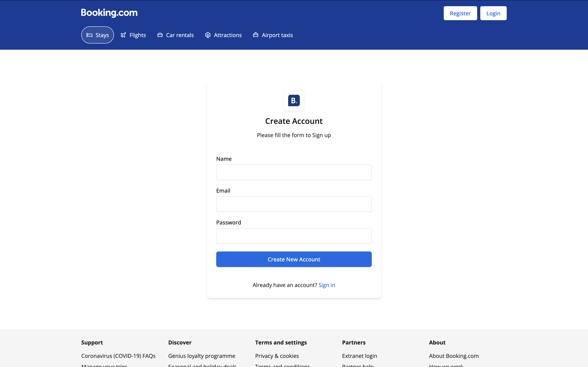

# Hotel Booking App (Booking.com / AirBnb_Clone)

This project is a frontend application clone inspired by Airbn and Booking.com .




## Prerequisites

Before running the frontend application, ensure you have the corresponding backend service set up and running.

* **Backend Service:** You need the associated backend running. Please find the setup instructions or repository link here: **[Link to your backend repository or setup instructions]**
    * You can typically run the backend either locally on your machine or by using Docker, as per the instructions provided in its own repository.

## Running the Frontend

Follow these steps to get the frontend development environment running:

1.  **Prepare Dependencies (React 19 Compatibility):**
    * React 19 requires specific versions of libraries like `react-day-picker` and `date-fns`. If you are setting up this project from scratch or encountering issues, it's recommended to ensure you have compatible versions. If you previously had older, incompatible versions installed, uninstall them first:
    ```bash
    npm uninstall react-day-picker
    npm uninstall date-fns
    ```
    *(You can skip this step if this is a fresh clone and install)*

2.  **Install Latest `react-day-picker`:**
    * Install the latest version of `react-day-picker`, which should be compatible with React 19.
    ```bash
    npm install react-day-picker@latest
    ```

3.  **Install Required `date-fns`:**
    * Install the version of `date-fns` required by the compatible `react-day-picker` (often v3).
    ```bash
    npm install date-fns@^3.6.0
    ```
    *(Verify if the installed `react-day-picker` version has different `date-fns` requirements if you encounter issues.)*

4.  **Install All Project Dependencies:**
    * This command installs all the remaining dependencies defined in `package.json`.
    ```bash
    npm install
    ```

5.  **Run the Development Server:**
    * This command starts the Vite development server, usually accessible at `http://localhost:5173`.
    ```bash
    npm run dev
    ```

Congratulations! The frontend application should now be running locally.

---

## React + Vite Boilerplate Info

This template provides a minimal setup to get React working in Vite with HMR and some ESLint rules.

Currently, two official plugins are available:

* [@vitejs/plugin-react](https://github.com/vitejs/vite-plugin-react/blob/main/packages/plugin-react/README.md) uses [Babel](https://babeljs.io/) for Fast Refresh
* [@vitejs/plugin-react-swc](https://github.com/vitejs/vite-plugin-react-swc) uses [SWC](https://swc.rs/) for Fast Refresh